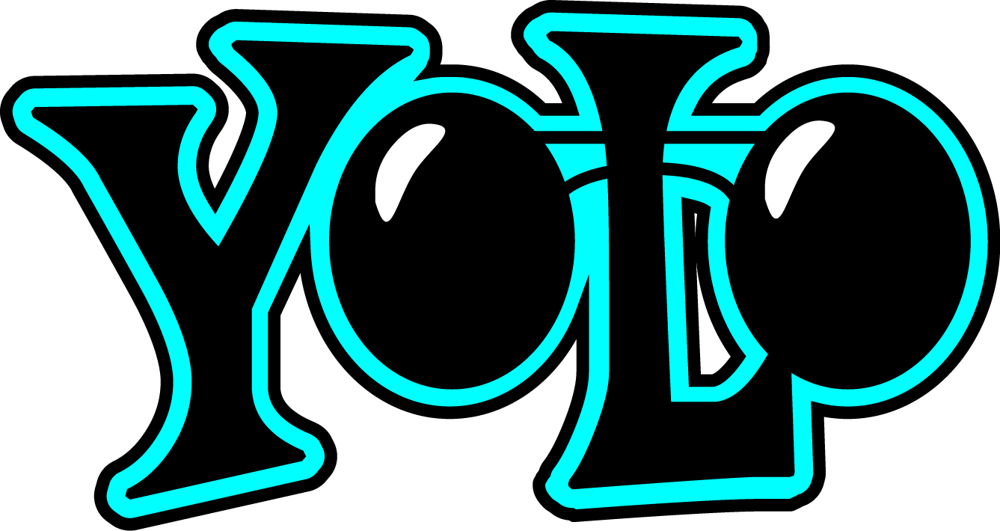

 <H1><b> Victor Sérgio Silva Barros </b> </H1>

 

# Dynamic Report using Parameters

Este projeto tem como objetivo modificar o relatório criativo inicial, focando na experiência do usuário. As alterações foram realizadas com base nos conceitos apresentados no curso, incluindo posicionamento, contraste, proporção áurea e segmentação dos dados.

## Objetivo do Desafio

O desafio consiste em criar um relatório dinâmico e interativo no Power BI, aplicando os seguintes conceitos:

- **Posicionamento**: Organizar os elementos de forma clara e intuitiva.
- **Contraste**: Utilizar cores e estilos para destacar informações importantes.
- **Proporção Áurea**: Aplicar princípios de design para criar um layout visualmente agradável.
- **Segmentação dos Dados**: Dividir as informações de forma lógica e acessível.

Além disso, o desafio incentiva a criatividade, permitindo que as regras sejam quebradas quando necessário para criar um relatório mais interessante e único.

## Próximos Passos

1. **Inserir Botões de Navegabilidade**:
   - Adicionar botões para facilitar a navegação entre as páginas do relatório.

2. **Modificar a Segunda Página**:
   - Ajustar o layout e o design da segunda página de forma similar ao demonstrado no desafio para a primeira página.

3. **Aprimorar os Botões de Navegabilidade**:
   - Destacar os botões para facilitar o foco e a seleção.

4. **Criar Menus de Navegabilidade**:
   - Adicionar menus em cada página para melhorar a experiência do usuário.

5. **Estilo Livre para os Botões**:
   - Personalizar o estilo dos botões de acordo com a criatividade do desenvolvedor.

6. **Relatório com 3 Páginas**:
   - Garantir que o relatório final seja composto por três páginas interativas.

## Considerações Finais

Este projeto é uma oportunidade para aplicar conceitos de design e usabilidade no Power BI, criando relatórios que não apenas apresentam dados, mas também proporcionam uma experiência visual e interativa para o usuário.

> **Nota**: Para mais detalhes sobre o processo de criação, acompanhe o vídeo explicativo fornecido no curso.

---

  
  

## License

This project is licensed under the MIT License.

## Version control

1.0.0

## Author

**Victor Sérgio Silva Barros**:

 

 

 

 

Please follow github and join us!
Thanks for visiting and happy coding!
